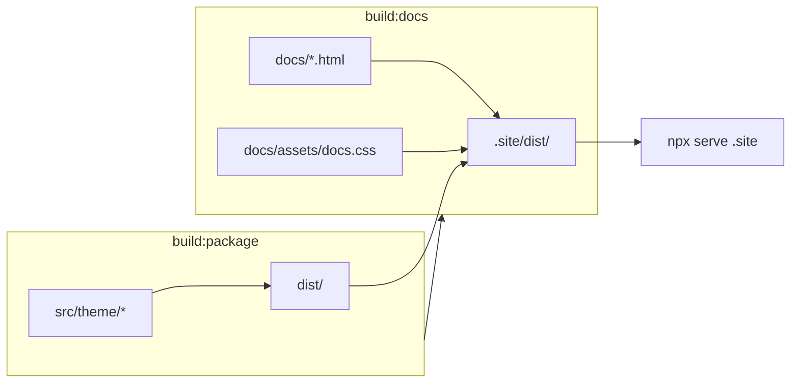

# Mimosa UI 架構快照（Tailwind 整合前）

> **用途：** 在進行「Mimosa + Tailwind 整合」之前，記錄**應恢復的目錄與職責邊界**。日後若需還原結構、或請 AI 對照「什麼該留、什麼不該留」，請**先讀本檔**，再以下方 **Git 基準 commit** 為準。

---

## 快照元資料

| 項目 | 值 |
|------|-----|
| **基準 commit** | `9fcc020f6c9f559760f291d5927e28758632f479` — `chore: update pages deployment workflow` |
| **基準分支** | `dev`（與 `main` 同指向此 commit） |
| **記錄日期** | 2026-05-15 |
| **npm 套件名** | `mimosa-design-system` |
| **設計主題** | v16 Psychedelic（token 前綴 `--psy-*`） |

### 還原到此架構基準

除本檔（`ARCHITECTURE-SNAPSHOT.md`）外，**整合前程式碼狀態**以 `9fcc020` 為準：

```bash
git fetch origin dev
git checkout dev
git reset --hard 9fcc020f6c9f559760f291d5927e28758632f479
git clean -fd
```

若要連本檔一併回到僅含 `9fcc020` 的樹（不含快照 commit），在上述指令後刪除 `docs/ARCHITECTURE-SNAPSHOT.md` 即可。

---

## 目錄樹（Git 追蹤檔案，整合前應長這樣）

```text
mimosa-ui/                          # repo 根目錄 = npm 套件本體（非 monorepo）
├── .gitignore                      # 忽略 node_modules、.site
├── README.md
├── package.json
├── package-lock.json
│
├── src/theme/                      # ★ 唯一「原始碼」CSS 來源
│   ├── tokens.css                  # --psy-* 唯一寫死 hex 的層
│   ├── mimosa.css                  # 完整產品樣式（raw，~1022 行）
│   ├── tailwind.css                # Tailwind v4 入口（給消費端編譯用）
│   └── tailwind/
│       ├── theme.css               # @theme 映射 tokens → Tailwind theme
│       ├── base.css                # 全域 base
│       ├── components.css          # @layer components：.psy-* primitives
│       └── flow-page.css           # 流程頁 .psy-flow-* 等
│
├── dist/                           # ★ 已 commit 的建置產物（copy，非 Tailwind 編譯）
│   ├── tokens.css
│   ├── tokens.json
│   ├── mimosa.css
│   ├── tailwind.css
│   └── tailwind/
│       ├── theme.css
│       ├── base.css
│       ├── components.css
│       └── flow-page.css
│
├── docs/                           # 靜態文件站「原始 HTML」
│   ├── index.html                  # 文件首頁
│   ├── design-system.html          # 完整設計系統展示（大檔）
│   ├── assets/
│   │   └── docs.css                # 文件站專用 raw（~1363 行，.ds-*）
│   └── ARCHITECTURE-SNAPSHOT.md    # 本檔
│
├── scripts/
│   ├── build.mjs                   # build:package → 寫 dist/
│   ├── build-docs.mjs              # build:docs → 組 .site/
│   └── deploy-github-pages.workflow.yml  # 需手動複製到 .github/workflows/
│
├── .site/                          # build:docs 產出（gitignore，不 commit）
└── node_modules/                   # gitignore
```

**刻意不存在、整合後也不應復活的舊結構：**

```text
mock-up/
shared/mimosa-ui/
examples/
v16-mock-preview/
design-system-site/   # 舊 Vite 多專案預覽
```

---

## 職責分工（什麼檔案做什麼）

### 1. `src/theme/tokens.css`

- **角色：** 設計 token **唯一真相來源**（`--psy-*`）。
- **整合後仍應保留：** 是。hex / 語意色仍只寫在這裡。
- **不應：** 在 `mimosa.css`、`docs.css`、HTML 再抄一份色票。

### 2. `src/theme/mimosa.css` → `dist/mimosa.css`

- **角色：** **完整 raw 產品樣式包**（landing、`.button`、`.chip`、`.alert`、`.form-*` 等）。
- **對外預設入口：** `package.json` 的 `"."` / `"style"` 指向此檔。
- **整合前現況：** 文件站與展示頁的「產品感」主要靠這份 + `docs.css`。
- **整合後方向（非本快照結構）：** 可標 legacy、逐步瘦身；**本快照要求的是路徑與 export 仍要存在**，直到消費端遷移完成。

### 3. `src/theme/tailwind.css` + `src/theme/tailwind/*`

- **角色：** Tailwind v4 **橋接層**（`@import "tailwindcss"` + `@theme` + `.psy-*` components）。
- **對外入口：** `mimosa-design-system/tailwind.css` 及細分 partials。
- **整合前現況：** 給**外部** Vite/Tailwind 專案用；**本 repo 文件站尚未編譯此入口**。
- **整合後仍應保留：** `src/theme/tailwind/` 目錄與 partial 拆分方式。

### 4. `docs/assets/docs.css`

- **角色：** **僅文件站**用的中性灰底版面（`.ds-*`，約 216 個以 `.ds-` 開頭的規則區塊）。
- **獨立 token：** `--ds-doc-*`（文件中性色，**不是** `--psy-*` 產品色）。
- **整合前 HTML：** 與 `../dist/mimosa.css` **雙 link**，無 Tailwind 編譯步驟。
- **整合後建議：** 可改名/搬至 `docs/src/docs-overrides.css` 並經 build 合併，但**職責不變**——文件版面 raw 疊加層。

### 5. `docs/*.html`

- **角色：** 靜態文件；class 混用：
  - `.ds-*`：文件 layout / 展示格（定義在 `docs.css`）
  - `.psy-*`：設計系統元件名（定義應在 `tailwind/components.css`，整合前常靠 `mimosa.css` 或視覺不完整）
  - HTML 內偶爾引用 `mimosa.css` 的 `.button` / `.form-*` 等**舊 class 名**（見 `design-system.html` 內文說明）
- **整合後仍應保留：** 兩個 HTML 檔與其語意區塊（可改 class，不應無故刪整頁）。

### 6. `scripts/build.mjs`

- **行為：** 刪除並重建 `dist/`；從 `src/theme/` **複製** `tokens.css`、`mimosa.css`、`tailwind.css` 與 `tailwind/*`；由 `tokens.css` 產生 `tokens.json`。
- **注意：** **不**執行 Tailwind CLI；`dist/tailwind.css` 仍是帶 `@import "tailwindcss"` 的**原始入口**，需消費端編譯。

### 7. `scripts/build-docs.mjs`

- **行為：**
  1. 清空並建立 `.site/`
  2. 複製 `docs/assets/` → `.site/assets/`
  3. 複製 `dist/` → `.site/dist/`
  4. 複製 `docs/index.html`、`docs/design-system.html`，並將 `../dist/` 改為 `./dist/`
- **無：** Vite、無 CSS 編譯、無 `dev:docs` script。

### 8. GitHub Pages

- Workflow 範本：`scripts/deploy-github-pages.workflow.yml`
- 部署產物目錄：`.site/`
- 觸發路徑：`docs/**`、`src/theme/**`、`scripts/build*.mjs`、`package.json` 等

---

## 建置與預覽流程（整合前）



```bash
npm install          # prepare → build:package
npm run build        # build:package && build:docs
npx serve .site      # 預覽文件站
```

---

## CSS 載入關係（整合前）

**文件 HTML（`docs/index.html`、`docs/design-system.html`）：**

```html
<link rel="stylesheet" href="../dist/mimosa.css" />
<link rel="stylesheet" href="./assets/docs.css" />
```

| 層級 | 檔案 | 內容類型 | 典型 class |
|------|------|----------|------------|
| 產品 token | `dist/tokens.css`（經 mimosa @import） | `--psy-*` | — |
| 產品樣式 | `dist/mimosa.css` | raw | `.button`, `.chip`, `.alert`, `.form-*` |
| Tailwind 橋（未用於 docs） | `dist/tailwind.css` | 需 host 編譯 | `.psy-brutal`, `.psy-btn`, utility |
| 文件版面 | `docs/assets/docs.css` | raw | `.ds-page`, `.ds-top`, `.ds-sidenav`, … |

**消費端（外部 app）三種模式：**

1. `import "mimosa-design-system"` → `mimosa.css`
2. `import "mimosa-design-system/tokens.css"` → 僅 token
3. `import "mimosa-design-system/tailwind.css"` + peer `tailwindcss@^4` → utility + `.psy-*`

---

## `package.json` 契約（整合前應維持的對外形狀）

```json
{
  "style": "./dist/mimosa.css",
  "exports": {
    ".": "./dist/mimosa.css",
    "./tokens.css": "./dist/tokens.css",
    "./tailwind.css": "./dist/tailwind.css",
    "./tailwind/theme.css": "./dist/tailwind/theme.css",
    "./tailwind/components.css": "./dist/tailwind/components.css",
    "./tokens.json": "./dist/tokens.json"
  },
  "peerDependencies": { "tailwindcss": "^4.0.0" },
  "scripts": {
    "build:package": "node ./scripts/build.mjs",
    "build:docs": "node ./scripts/build-docs.mjs",
    "build": "npm run build:package && npm run build:docs",
    "prepare": "npm run build:package"
  }
}
```

**無** `devDependencies` 中的 `tailwindcss`（僅 peer，由消費端安裝）。

---

## 整合後「結構恢復」檢查清單

還原或 code review 時，確認下列**骨架**仍在（實作可變，路徑與職責不應亂掉）：

### 必須保留（路徑 / 職責）

- [ ] `src/theme/tokens.css` — 唯一 token 來源
- [ ] `src/theme/tailwind.css` + `src/theme/tailwind/{theme,base,components,flow-page}.css`
- [ ] `src/theme/mimosa.css` — 至少作 legacy 或過渡期完整包（路徑不刪，直到明確棄用）
- [ ] `dist/` 作為 npm `files` 發佈內容（或同等 build 輸出目錄）
- [ ] `docs/index.html`、`docs/design-system.html`
- [ ] 文件專用 raw 層（現 `docs/assets/docs.css` 或更名後的 overrides，職責等同）
- [ ] `scripts/build.mjs`、`scripts/build-docs.mjs`（行為可擴充，但 `build` → `.site/` 鏈路要存在）
- [ ] `.site/` 仍為 Pages 部署根目錄
- [ ] `package.json` 的 `exports` 至少仍提供 `tokens.css`、`tailwind.css`、`mimosa.css`（名稱可增不可無故減）

### 允許變更（整合的正常結果）

- [ ] 新增 `docs/src/*.css`、Tailwind 編譯 script、`dev:docs`
- [ ] 文件 HTML 改為 link **單一編譯後 CSS**（仍須含 tokens + tailwind + components + docs overrides）
- [ ] `docs.css` / overrides 行數變少（`.ds-*` 能用 utility 取代的規則可刪）
- [ ] `mimosa.css` 行數變少（樣式搬到 `@layer components` 或 utility）
- [ ] `package.json` 新增 `devDependencies.tailwindcss`（**僅 repo 建 docs 用**，不取代 peer）
- [ ] README 更新預覽指令與 Tailwind-first 說明

### 不應恢復（已淘汰）

- [ ] `mock-up/`、`shared/`、`examples/` 多專案目錄
- [ ] 文件站依賴 `file://` 直接開 HTML 而不 build（Tailwind v4 無法這樣用）
- [ ] 在 `docs.css` 複製 `--psy-*` hex
- [ ] 第二份與 `tokens.css` 重複的 token 檔

---

## 目標架構（整合完成後，相對於本快照的「演進」）

整合**成功**後，結構應仍是上節「必須保留」的骨架，但 CSS 堆疊變為：

```text
tokens.css
  → tailwind.css（編譯出 utility）
  → tailwind/components.css（.psy-*）
  → docs-overrides.css（.ds-* 文件專用 raw）
  → mimosa.css（legacy，逐步縮小）
```

**給 AI 的一句話：**  
> 若使用者要求「恢復到整合前架構」，請對照 **commit `9fcc020` 的目錄樹與本檔「必須保留」**，並還原 **雙 CSS link（mimosa + docs.css）、無 docs Tailwind 編譯**；若要求「保留整合成果」，則只恢復骨架、不刪 Tailwind 管線。

---

## 相關檔案行數參考（`9fcc020`）

| 檔案 | 約略行數 |
|------|----------|
| `src/theme/tokens.css` | ~380 |
| `src/theme/mimosa.css` | ~1022 |
| `docs/assets/docs.css` | ~1363 |
| `docs/design-system.html` | 大檔（完整 DS 展示） |
| `docs/index.html` | ~130 |

---

*本檔隨整合推進可追加「整合後快照」章節，但請勿刪除上述「整合前」基準，以便 diff 與還原。*
