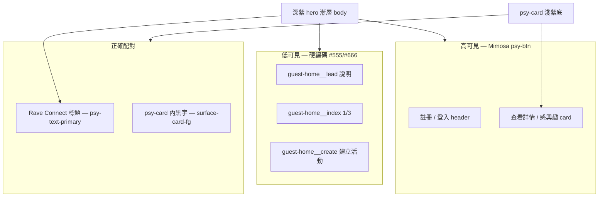

# 04 Report — 訪客首頁深色背景上的視覺層級、對比與 Mimosa 配對問題

**建立日期：** 2026-06-04  
**回報目的：** 提供給 `mimosa-design-system` 維護者與 Rave Connect 團隊，說明在 **深色 hero 漸層頁面**上，訪客首頁（Guest Home）多處次要文字與 tertiary 動作 **正常瀏覽狀態下幾乎不可讀**，且與 Mimosa neo-brutalist 按鈕的高對比策略嚴重失衡。本報告附完整專案 context、DOM/CSS 證據、與責任邊界（設計系統缺口 vs 消費端誤用）。

---

## 1. 摘要（給 Mimosa 作者的一頁版）

| 項目 | 說明 |
|------|------|
| **現象** | 說明文字、分頁指示（`1 / 3`）、「建立活動」連結在深色紫紅漸層背景上對比不足，使用者需靠 DevTools 或反白才發現內容存在。 |
| **直接 CSS 原因** | 消費端 `guest-home.page.css` 對深底元素硬編碼 `#555`、`#666`、`#ccc`（典型 **淺色頁面** 灰字），未使用 Mimosa 的 `--psy-text-primary` / `--psy-text-secondary` 或 `psy-kicker-on-dark` 等 **on-dark** 配對。 |
| **設計系統層面** | Mimosa `0.2.7` README 已說明 surface + on-surface 配對，但 **缺少**「深底頁面次要內文」「深底文字連結」「深底輪播導覽」等公開 primitive；消費端易退回 Bootstrap 時代 `#666` 習慣，與螢光按鈕並存時層級崩壞。 |
| **建議 Mimosa** | 補齊 on-dark 文案／連結／icon control token 與 class、擴充 pairing 文件與範例、考慮 a11y 對照表。 |
| **建議 Rave Connect** | 短期改 feature CSS 對齊 token（見 §8）；中長期將次要文案收進 `@rave/frontend/ui` wrapper。 |

---

## 2. 專案 Context（為何會出現這個畫面）

### 2.1 產品與頁面

- **產品：** Rave Connect（台灣地下電音活動探索／交友 App，monorepo `rave-connect`）。
- **頁面：** **訪客首頁** `Guest Home`，路由 **`/`**，未登入使用者的預設著陸頁（SDD `docs/sdd/06-ui-ux.md` § Guest Home、§ 訪客著陸）。
- **功能概要：** Carousel 預覽公開活動（mock／`GET /events` 訪客模式）、固定「註冊」「登入」、互動（感興趣、建立活動等）觸發登入引導。
- **實作位置（Web；Mobile 結構對稱）：**
  - `apps/web/src/app/features/guest-home/guest-home.page.html`
  - `apps/web/src/app/features/guest-home/guest-home.page.css`
  - `apps/mobile/src/app/features/guest-home/`（同上）

### 2.2 技術棧與 Design System 整合方式

```text
Framework:
  - Angular 20.3.x
  - Ionic 8（Mobile shell）
  - Tailwind CSS 4
Design System:
  - mimosa-design-system@0.2.7（npm，不複製原始碼進 repo）
Style entry（全站）:
  - shared/frontend/styles/app.css
    @import "mimosa-design-system/tailwind.css";
  - :root { color-scheme: dark; }
  - body {
      background: var(--psy-gradient-hero-panel), var(--psy-surface-page-deep);
      color: var(--psy-text-primary);
    }
UI wrappers:
  - @rave/frontend/ui → rave-button（psy-btn primary/secondary/ghost）
  - @rave/frontend/ui → rave-card（psy-card）
```

### 2.3 與先前 Mimosa 報告的關係

| 報告 | 主題 | 與本報告關聯 |
|------|------|----------------|
| `02-report-mimosa-design-system-ui-contrast-after-upgrade.md` | 淺色 `psy-card` / `empty-state` 上 kicker、內文過淡 | 同為 **surface 與 foreground 配對錯誤**；本報告為 **深底頁面** 反向問題（用了淺底灰字）。 |
| `03-report-mimosa-mobile-button-layout-issue.md` | Mobile CTA layout | 訪客首頁 header CTA 使用 Mimosa 按鈕，視覺正常；問題在 **非按鈕的次要資訊層**。 |
| `mimosa-design-system-ui-smoke-issue.md` | 早期 smoke | 已過時參考。 |

### 2.4 規格對「建立活動」的期待 vs 畫面

SDD 訪客首頁寫明：「訪客模式不顯示『建立活動』**主 CTA**（若顯示則點擊走登入引導）」。目前實作在頁尾以 **幾乎看不見的 `#666` 底線文字** 呈現，既不符合「主 CTA」語意，也違反可讀性與當代 UI 對 **次要動作仍須可發現** 的期待。

---

## 3. 測試環境與重現步驟

```text
URL: http://localhost:4200/
Command: npm run start:web
Browser: Chrome（使用者提供 DevTools 截圖，2026-06-04）
Angular: 20.3.x（ng-version 18.x 出現在舊截圖屬 dev 快取差異，以 package.json 為準）
mimosa-design-system: 0.2.7
```

**重現：**

1. 啟動 Web dev server，開啟 `/`。
2. 不選取任何文字，直接觀察標題下方說明、卡片下方 `1 / 3`、頁尾「建立活動」。
3. 開啟 DevTools → Elements，選取 `.guest-home__lead`、`.guest-home__index`、`.guest-home__create` 檢視 computed `color`。

**截圖（本 repo 工作區路徑，供 Mimosa 作者對照）：**

- 全頁低對比概況：`.cursor/projects/.../assets/___2026-06-04___9.03.15-*.png`
- `.guest-home__lead` → `color: #555`：`*9.05.11-*.png`
- `.guest-home__index` → `color: #666`：`*9.05.19-*.png`
- `.guest-home__create` → `color: #666`、透明底：`*9.05.25-*.png`

---

## 4. 問題清單（逐項）

### 4.1 說明文字 —「探索電音活動 — 左右切換預覽，互動需先註冊或登入」

| 欄位 | 內容 |
|------|------|
| DOM | `<p class="guest-home__lead">…</p>` |
| 位置 | 全頁 **深紫紅漸層**（`body` 的 `--psy-gradient-hero-panel` + `--psy-surface-page-deep`） |
| 實際 CSS | `.guest-home__lead { color: #555; margin: 1rem 0; }` |
| 對比狀態 | `#555`（RGB 85,85,85）在近似 `#18002d`～`#2a0146` 的漸層上，對比遠低於 WCAG 2.1 AA（一般文字 4.5:1） |
| 語意角色 | 頁面 **lead / helper**，應引導使用者理解 Carousel 與登入門檻 |
| 實際層級 | 視覺上低於背景噪點，使用者以為頁面缺文案 |

**同頁可讀的對照：** `<h1 class="guest-home__brand">Rave Connect</h1>` 未覆寫 color，繼承 `body` 的 `var(--psy-text-primary)`（`#fff6ff` 系），故標題清晰。說明文字 **刻意** 用了與全站 token 脫鉤的硬編碼色。

### 4.2 分頁指示 —「1 / 3」

| 欄位 | 內容 |
|------|------|
| DOM | `<p class="guest-home__index">{{ activeIndex() + 1 }} / {{ events().length }}</p>` |
| 實際 CSS | `.guest-home__index { color: #666; font-size: 0.875rem; text-align: center; }` |
| 問題 | 輪播 **狀態回饋** 應為 secondary 但可掃讀；`#666` 在深底上與 lead 相同不可讀 |
| 附註 | 截圖中分頁下方可見細橫條（可能為瀏覽器 focus 或尚未實作 progress；若未來加 progress bar，需一併定義 on-dark token） |

### 4.3 Tertiary 動作 —「建立活動」

| 欄位 | 內容 |
|------|------|
| DOM | `<button type="button" class="guest-home__create">建立活動</button>` |
| 實際 CSS | `background: transparent; border: none; color: #666; text-decoration: underline;` |
| 問題 | 外觀像失效連結；與 header **螢光黃／萊姆綠 + 黑框陰影** 按鈕形成極端反差，**重要次要動作被埋沒** |
| 互動 | 點擊會觸發登入引導（行為正確），但 **可發現性（discoverability）** 失敗 |

### 4.4 其他同檔案、同模式問題（建議一併修正）

| Class | 用途 | 色碼 | Surface |
|-------|------|------|---------|
| `.guest-home__nav` | Carousel ‹ › | `border: 1px solid #ccc`、透明底 | 深底 |
| `.guest-home__modal-note` | Modal 內唯讀說明 | `#555` | **淺色** `psy-card` 內 — 可能勉強可讀，但仍非 Mimosa `--psy-text-muted-on-light` |
| `.guest-home__dismiss` | Auth prompt「稍後」 | `#666` | Modal 淺卡內 |
| `.guest-home__cover-fallback` | 封面載入失敗 | `rgb(255 255 255 / 55%)` | 深紫 cover 區 — 屬刻意弱化，可接受但宜改 token |

### 4.5 視覺層級與邏輯一致性（非單一 hex 問題）



**觀察：**

1. **同一頁面**混用三套邏輯：Mimosa 深底主色、Mimosa 淺卡黑字、自訂淺灰字（誤用在深底）。
2. **Neo-brutalist 按鈕**（高飽和、粗框、硬陰影）搶走全部注意力，符合 Mimosa 品牌，但 **沒有對等的 on-dark 次要 typography system**，導致說明與分頁像「未載入樣式」。
3. **輪播箭頭**（細線 `#ccc` 圓框）與按鈕 **stroke / weight 不一致**，圖示語言分裂。
4. 當代產品慣例：深色著陸頁的 helper 文案多用 **高對比 secondary**（淺灰字至少 `#b8b8b8` 以上，或設計系統 muted on-dark），tertiary 動作用 **ghost button** 或 **underline link on-dark**，而非 `#666` on `#2a0146`。

---

## 5. Mimosa Design System 既有能力（對照）

### 5.1 官方文件已宣告的配對原則

`mimosa-design-system@0.2.7` README § 視覺邏輯：

- 深色頁面：`psy-page-bg`，文字用 `--psy-text-primary` / `--psy-text-secondary`。
- 淺色 elevated：`psy-card`，文字用 card foreground / `psy-kicker-on-card`。
- 深紫底 kicker：`psy-kicker-on-dark`（螢光萊姆色）。

### 5.2 相關 token 實值（`dist/tokens.css`）

```css
--psy-primitive-text: #fff6ff;
--psy-primitive-text-muted: #fff2f9;
--psy-text-primary: var(--psy-color-primary-on-dark);      /* ≈ 淺粉白 */
--psy-text-secondary: var(--psy-color-primary-on-dark-muted);
--psy-surface-page-deep: … /* 近 #18002d 黑紫 */
--psy-gradient-hero-panel: /* 橘／洋紅／萊姆半透明漸層疊加 */
```

Rave Connect **全站 body** 已套用 hero 漸層 + `--psy-text-primary`，故 **標題與未覆寫元素可讀**。

### 5.3 本專案 smoke 頁的正確範例（未套用在 guest-home）

`apps/web/src/app/features/index/index.page.html`：

```html
<p class="psy-kicker-on-dark">Basic UI smoke</p>
```

顯示團隊 **已知** Mimosa 的 on-dark kicker，但 guest-home 說明行 **未使用** 任何 Mimosa 公開 class，亦未引用 CSS variable。

### 5.4 Mimosa 目前 **未** 明確提供的消費端需求

| 需求 | 現狀 | 後果 |
|------|------|------|
| 深底 **內文級** helper（非全大寫 kicker） | 僅 `psy-kicker-on-dark`（uppercase、小字、萊姆） | 開發者寫段落說明時易寫死 `#555` |
| 深底 **caption / meta**（如 `1 / 3`） | 無 `psy-caption-on-dark` 等 | 寫死 `#666` |
| 深底 **text link / tertiary** | 有 `psy-btn-ghost`，但 README 未強調用於「建立活動」類動作 | 做成透明底 `#666` underline |
| 深底 **icon button / carousel control** | 無標準 class | `#ccc` 1px 圓框自訂 |
| **禁止** 在 `color-scheme: dark` 下使用 `#555`/`#666` 的 lint 或文件警示 | 無 | 反模式反覆出現 |

---

## 6. 無障礙（WCAG）粗估

> 以下為依 token 與硬編碼色推算的 **診斷用** 估計，非正式 audit 工具結果。

| 前景 | 背景（近似） | 粗估對比 | AA 4.5:1 |
|------|----------------|----------|------------|
| `#fff6ff`（`--psy-text-primary`） | `#2a0146` | 高 | 通過 |
| `#555`（lead） | `#2a0146` | ~2:1 或更低 | **失敗** |
| `#666`（index / create） | `#2a0146` | ~2.5:1 或更低 | **失敗** |
| `#666`（create） | 漸層亮區 | 仍偏低 | **失敗** |
| `psy-card` 內 `--psy-surface-card-fg` | 淺紫卡 | 高 | 通過 |

**結論：** 問題元素在「正常狀態」即不符合當代 a11y 對 **內文與控制項** 的最低期待；不應依賴使用者選取反白（與 report 02 相同診斷線索）。

---

## 7. 責任邊界（供雙方對齊）

### 7.1 Rave Connect（消費端）— 確定需修正

- `guest-home.page.css` 中 `#555`、`#666`、`#ccc` 為 **feature 層反模式**，非 Mimosa 套件輸出。
- 修正方向（不改 Mimosa 原始碼即可改善）：
  - `.guest-home__lead` → `color: var(--psy-text-secondary);` 或改 markup 為 `<p class="psy-kicker-on-dark">`（若接受 uppercase 語意）。
  - `.guest-home__index` → `color: var(--psy-text-secondary);`
  - `.guest-home__create` → 改用 `<rave-button variant="ghost">` 或 Mimosa link token（待提供）。
  - `.guest-home__nav` → 使用 `--psy-border-strong` / on-dark icon token（待提供）。

### 7.2 Mimosa Design System（建議官方回應）

1. **文件：** 在 README 增加「深底 hero 頁」完整範例：lead 段落、pagination、tertiary CTA、carousel control，明確寫 **禁止** `#555`/`#666`。
2. **元件／utility class（擇一或並行）：**
   - `psy-text-body-on-dark`（一般內文 secondary）
   - `psy-text-meta-on-dark`（caption、`1 / 3`）
   - `psy-link-on-dark` 或文件化 `psy-btn-ghost` 用於 tertiary
   - `psy-icon-btn-on-dark`（輪播箭頭，stroke 與 `psy-btn` 框線粗細協調）
3. **Pairing 表：** surface（page-deep / on-dark / card）× 允許的 text / kicker / link / button variant。
4. **a11y：** 在 tokens 或 Storybook 標註 `--psy-text-secondary` 對 `--psy-surface-page-deep` 的實測對比比。
5. **與 report 02 一併：** 淺卡 `psy-kicker` vs 深底 `psy-kicker-on-dark` 的決策樹圖。

---

## 8. 建議修正範例（Rave Connect 短期；供 Mimosa 作者驗證配對）

```css
/* 建議取代 guest-home.page.css 硬編碼（示意） */
.guest-home__lead {
  color: var(--psy-text-secondary);
  margin: 1rem 0;
}

.guest-home__index {
  color: var(--psy-text-secondary);
  font-size: 0.875rem;
  text-align: center;
}

/* tertiary 建議改 HTML 使用 rave-button variant="ghost"，而非自訂 button */
```

```html
<!-- lead 若需強調「操作說明」語意，可選 kicker -->
<p class="psy-kicker-on-dark guest-home__lead">
  探索電音活動 — 左右切換預覽，互動需先註冊或登入
</p>
```

---

## 9. 相關程式與規格索引

```text
# 問題 CSS（Web）
apps/web/src/app/features/guest-home/guest-home.page.css
apps/web/src/app/features/guest-home/guest-home.page.html

# Mobile（對稱）
apps/mobile/src/app/features/guest-home/

# 全站深底
shared/frontend/styles/app.css

# Mimosa 參考
node_modules/mimosa-design-system/README.md
node_modules/mimosa-design-system/dist/tokens.css
node_modules/mimosa-design-system/dist/tailwind/components.css  (.psy-kicker-on-dark)

# UI wrapper
shared/frontend/ui/src/lib/button.component.ts
shared/frontend/ui/src/lib/card.component.ts

# 規格
docs/sdd/06-ui-ux.md — Guest Home、訪客著陸
docs/prd/PRD.md — 訪客探索（若需產品脈絡）
```

---

## 10. 最小驗收標準（修正後）

在 **未選取文字**、**未開 DevTools** 的正常瀏覽狀態下：

- [ ] 「探索電音活動 — 左右切換預覽…」可在 3 秒內被新使用者讀到。
- [ ] `1 / 3`（或等價進度）可清楚辨識為輪播狀態。
- [ ] 「建立活動」作為 tertiary 動作，視覺上弱於 header 註冊／登入，但 **仍可被發現**（建議 ghost button 或 on-dark link）。
- [ ] 深底文案、淺卡內文、螢光按鈕三者感覺屬於 **同一套 Mimosa 系統**，而非「按鈕來自 DS、說明來自 2010 年 Bootstrap」。
- [ ] Web `/` 與 Mobile 訪客首頁行為與可讀性一致。

---

## 11. 給 Mimosa 作者的提問清單

1. 深底 hero 頁的 **非 kicker 段落說明**，官方推薦 class／token 組合為何？是否 `--psy-text-secondary` 即為唯一答案？
2. `psy-kicker-on-dark` 是否適用於繁體中文長句說明（含 uppercase 轉換）？若不適用，是否新增 `psy-lead-on-dark`？
3. 分頁 `1 / 3` 是否應有獨立 meta token，避免與 body secondary 混用？
4. Tertiary 動作（如「建立活動」）在深底上應優先 `psy-btn-ghost` 還是 text link？請提供視覺層級示意。
5. Carousel 圓形箭頭是否納入 design system？如何與 `psy-btn` 粗框語言對齊？
6. 是否在文件或 ESLint/stylelint 中 **明確禁止** 在 `color-scheme: dark` + `psy-page-bg` 場景使用 `#555`–`#777`？

---

## 12. 備註

- 本報告 **不要求** Mimosa 作者修改 Rave Connect repo；消費端 CSS 修正可由 Rave 團隊獨立完成（§8）。
- 若 Mimosa 新增 on-dark typography primitive，建議同步更新 `shared/frontend/ui` 與 `docs/sdd/06-ui-ux.md` 的 Design System 章節，避免下一個 feature 再次硬編碼灰色。
- `mimosa-design-system@0.2.7` 的按鈕與 `psy-card` 在訪客首頁上 **運作正常**；問題核心是 **深底次要資訊層缺位 + 消費端未遵循既有 token**。

---

**報告維護：** Rave Connect 前端／設計對接  
**關聯 task：** `tasks/06-UI-002-02`（訪客首頁）、`06-UI-002-02b`（封面 UI）
